# Writing a CreateUiDefinition
This document explains how to write a CreateUiDefinition, which is used by
the Azure Portal to generate UI for creating multi-virtual machine deployments.


## Overview
```json
{
  "handler": "Microsoft.Compute.MultiVm",
  "version": "0.0.1-preview",
  "parameters": {
    "basics": [],
    "steps": [],
    "outputs": {}
  }
}
```

A CreateUiDefinition always contains three properties: `handler`, `version`, and
`parameters`. For the purposes of this document, the `handler` should always be
`Microsoft.Compute.MultiVm`, and the only supported `version` is
`0.0.1-preview`. In the future, additional versions will be available that
enable additional functionality.

The schema of the  `parameters` property depends on the combination of the
specified `handler` and `version`. Today, the supported properties are `basics`,
`steps`, and `outputs`. The `basics` and `steps`properties contain the elements
to be displayed in the UI, and the `outputs` property is used to map the output
values of elements to the `parameters` of the Azure Resource Manager template.

### Basics
The Basics step is always the first step of the wizard generated when the
Azure Portal parses a CreateUiDefinition. In addition to displaying the elements
specified in `basics`, the portal also injects elements for users to choose the
subscription, resource group, and location for the deployment. Generally,
elements that query for deployment-wide parameters, like the name of a cluster
or administrator credentials, should go in this step.

### Steps
The `steps` property can contain zero or more additional steps to display after
basics, each of which contains one or more elements. Consider adding steps per
role or tier of the application being deployed, like a step for questions
related to the master and another for the slaves.

### Outputs
The `outputs` property is used by the Azure Portal to map the output values of
the elements specified in `basics` and `steps` to the `parameters` of the
associated Azure Resource Manager template. The keys of this dictionary are the
names of the template parameters, and the values are properties of the output
objects from the referenced elements. Another usage for `outputs` is to
map the output of one element to the input (for example, `defaultValue`) of
another element. This can be used between elements on different and the same
steps.


## Element schema
This section contains the schema for each of the supported elements that can be
referenced in the `basics` and `steps` properties of a CreateUiDefinition. The
schema for most elements is as follows:
```json
{
  "name": "element1",
  "type": "Microsoft.Common.TextBox",
  "label": "Some text box",
  "defaultValue": "foobar",
  "toolTip": "Keep calm and visit the [Azure Portal](portal.azure.com).",
  "constraints": {},
  "options": {}
}
```

- `name` (required) is used as an internal identifier to reference a specific
instance of an element. The most common usage of the element `name` is in
`outputs` when the output values of the elements in `basics` and `steps` are
mapped to the `parameters` of the template. It can also be used to bind the
output value of an element to the `defaultValue` of another element.
- `type` (required) is used to determine which UI control to render for the
element. A list of supported types and their respective schemas is contained
in the this document.
- `label` (required) is the display text of the element. Some element types
contain multiple labels, so the value could be an object containing multiple
strings.
- `defaultValue` (optional) is the default value of the element. Some element
types support complex default values, so the value could an object.
- `toolTip` (optional) is the text to display in the tool tip of the element.
Similar to `label`, some elements support multiple tool tip strings. Inline
links can be embedded using Markdown syntax.
- `constraints` (optional) contains one or more properties that are used to
customize the validation behavior of the element. The supported properties for
`constraints` varies by element `type`. Some element types do not support
customization of the validation behavior, and thus have no `constraints`
property.
- `options` (optional) contains additional properties that customize the
behavior of the element. Similar to `constraints`, the supported properties
vary by element `type`.

### Microsoft.Common.TextBox
#### UI sample
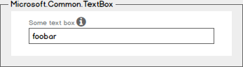

#### Schema
```json
{
  "name": "element1",
  "type": "Microsoft.Common.TextBox",
  "label": "Some text box",
  "defaultValue": "foobar",
  "toolTip": "Halp!",
  "constraints": {
    "required": true,
    "regex": "^[a-z0-9A-Z]{1,30}$",
    "validationMessage": "Only alphanumeric characters are allowed, and the value must be 1-30 characters long."
  }
}
```
- If `constraints.required` is set to `true`, then the text box must contain a
value to validate successfully. The default value is `false`.
- `constraints.regex` is a JavaScript regular expression pattern. If specified,
then the text box's value must match the pattern to validate successfully. The
default value is `null`.
- `constraints.validationMessage` is a string to display when the text box's
value fails validation. If not specified, then the text box's built-in
validation messages are used. The default value is `null`.
- It's possible to specify a value for `constraints.regex` when
`constraints.required` is set to `false`. In this scenario, a value will not be
required for the text box to validate successfully, but if one is specified,
then it must match the regular expression pattern.

#### Output
```json
"foobar"
```

### Microsoft.Common.PasswordBox
#### UI sample
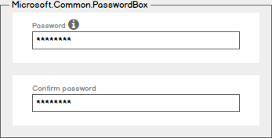

#### Schema
```json
{
  "name": "element1",
  "type": "Microsoft.Common.PasswordBox",
  "label": {
    "password": "Password",
    "confirmPassword": "Confirm password"
  },
  "toolTip": "",
  "constraints": {
    "required": true,
    "regex": "",
    "validationMessage": ""
  },
  "options": {
    "hideConfirmation": false
  }
}
```
- This element does not support the `defaultValue` property.
- For implementation details of `constraints`, see [Microsoft.Common.TextBox](#microsoft-common-textbox)
- If `options.hideConfirmation` is set to `true`, then the second text box for
confirming the user's input is hidden. The default value is `false`.

#### Output
```json
"p4ssw0rd"
```

### Microsoft.Common.DropDown
#### UI sample
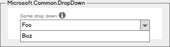

#### Schema
```json
{
  "name": "element1",
  "type": "Microsoft.Common.DropDown",
  "label": "Some drop down",
  "defaultValue": "Foo",
  "toolTip": "",
  "constraints": {
    "allowedValues": [
      {
        "label": "Foo",
        "value": "Bar"
      },
      {
        "label": "Baz",
        "value": "Qux"
      }
    ]
  }
}
```
- If specified, the value for `defaultValue` must be present in
`constraints.allowedValues`. If not specified, the first item in
`constraints.allowedValues` is selected by default. The default value is `null`.
- `constraints.allowedValues` must contain at least one item.
- The `label` for `constraints.allowedValues` is the display text for an item,
and its `value` is the output value of the element when selected.
- This element does not support the `constraints.required` property. To emulate
this behavior, add an item with a `label` and `value` of `""` (empty string) to
`constraints.allowedValues`.

#### Output
```json
"Bar"
```

### Microsoft.Common.OptionsGroup
#### UI sample
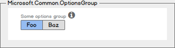

#### Schema
```json
{
  "name": "element1",
  "type": "Microsoft.Common.OptionsGroup",
  "label": "Some options group",
  "defaultValue": "Foo",
  "toolTip": "",
  "constraints": {
    "allowedValues": [
      {
        "label": "Foo",
        "value": "Bar"
      },
      {
        "label": "Baz",
        "value": "Qux"
      }
    ]
  }
}
```
- If specified, the value for `defaultValue` must exist in
`constraints.allowedValues`. If not specified, the first item in
`constraints.allowedValues` is selected by default. The default value is `null`.
- `constraints.allowedValues` must contain at least one item.
- The `label` for `constraints.allowedValues` is the display text for an item,
and its `value` is the output value of the element when selected.
- This element does not support the `constraints.required` property; an item
must always be selected.

#### Output
```json
"Bar"
```

### Microsoft.Common.FileUpload
#### UI sample
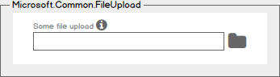

#### Schema
```json
{
  "name": "element1",
  "type": "Microsoft.Common.FileUpload",
  "label": "Some file upload",
  "toolTip": "",
  "constraints": {
    "required": true,
    "accept": ".doc,.docx,.xml,application/msword",
  },
  "options": {
    "multiple": false,
    "uploadMode": "file",
    "openMode": "text",
    "encoding": "UTF-8",
  }
}
```
- `constraints.accept` specifies the types of files that will be shown in the
browser's file dialog. See the
[HTML5 specification](http://www.w3.org/TR/html5/forms.html#attr-input-accept)
for allowed values. The default value is `null`.
- If `options.multiple` is set to `true`, then the user will be allowed to
select more than one file in the browser's file dialog. The default value is
`false`.
- This element supports uploading files in two modes based on the value of
`options.uploadMode`. If `file` is specified, then the output will be the
contents of the file as a blob. If `url` is specified, then the file will be
uploaded to a temporary location, and the output will be a URL of the blob. The
default value is `file`.
- The value of `options.openMode` determines how the file will be read. If the
file is expected to be plain text, specify `text`; else, specify `binary`. The
default value is `text`.
- If `options.uploadMode` is set to `file` and `options.openMode` is set to
`binary`, then the output will be base64-encoded.
- `options.encoding` specifies the encoding to use when reading the file. The
default value is `UTF-8`, and is used only when `options.openMode` is set to
`text`.

#### Output
If `options.multiple` is `false` and `options.uploadMode` is `file`, then the
output will be the contents of the file as a JSON string:
```json
"Lorem ipsum dolor sit amet, consectetur adipiscing elit, sed do eiusmod tempor incididunt ut labore et dolore magna aliqua."
```

If `options.multiple` is `true` and `options.uploadMode` is `file`, then the
output will be the contents of the files as a JSON array:
```json
[
  "Lorem ipsum dolor sit amet, consectetur adipiscing elit, sed do eiusmod tempor incididunt ut labore et dolore magna aliqua.",
  "Ut enim ad minim veniam, quis nostrud exercitation ullamco laboris nisi ut aliquip ex ea commodo consequat.",
  "Duis aute irure dolor in reprehenderit in voluptate velit esse cillum dolore eu fugiat nulla pariatur.",
  "Excepteur sint occaecat cupidatat non proident, sunt in culpa qui officia deserunt mollit anim id est laborum."
]
```

If `options.multiple` is `false` and `options.uploadMode` is `url`, then the
output will be a URL as a JSON string:
```json
"https://myaccount.blob.core.windows.net/pictures/profile.jpg?sv=2013-08-15&st=2013-08-16&se=2013-08-17&sr=c&sp=r&rscd=file;%20attachment&rsct=binary &sig=YWJjZGVmZw%3d%3d&sig=a39%2BYozJhGp6miujGymjRpN8tsrQfLo9Z3i8IRyIpnQ%3d"
```

If `options.multiple` is `true` and `options.uploadMode` is `url`, then the
output will be a list URLs as a JSON array:
```json
[
  "https://myaccount.blob.core.windows.net/pictures/profile1.jpg?sv=2013-08-15&st=2013-08-16&se=2013-08-17&sr=c&sp=r&rscd=file;%20attachment&rsct=binary &sig=YWJjZGVmZw%3d%3d&sig=a39%2BYozJhGp6miujGymjRpN8tsrQfLo9Z3i8IRyIpnQ%3d",
  "https://myaccount.blob.core.windows.net/pictures/profile2.jpg?sv=2013-08-15&st=2013-08-16&se=2013-08-17&sr=c&sp=r&rscd=file;%20attachment&rsct=binary &sig=YWJjZGVmZw%3d%3d&sig=a39%2BYozJhGp6miujGymjRpN8tsrQfLo9Z3i8IRyIpnQ%3d",
  "https://myaccount.blob.core.windows.net/pictures/profile3.jpg?sv=2013-08-15&st=2013-08-16&se=2013-08-17&sr=c&sp=r&rscd=file;%20attachment&rsct=binary &sig=YWJjZGVmZw%3d%3d&sig=a39%2BYozJhGp6miujGymjRpN8tsrQfLo9Z3i8IRyIpnQ%3d"
]
```

### Microsoft.Common.Section
The section element provides a grouping mechanism for one or more child
elements in a single blade.
#### UI sample
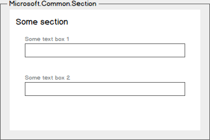

#### Schema
```json
{
  "name": "section1",
  "type": "Microsoft.Common.Section",
  "label": "Some section",
  "elements": [
    {
      "name": "element1",
      "type": "Microsoft.Common.TextBox",
      "label": "Some text box 1"
    }
    {
      "name": "element2",
      "type": "Microsoft.Common.TextBox",
      "label": "Some text box 2"
    }
  ]
}
```
- `elements` must contain at least one element, and can contain all element
types except `Microsoft.Common.Section`.
- This element does not support the `toolTip` or `defaultValue` properties.

#### Output
To access the output values of elements in `elements`, use the `basics()` or
`steps()` functions and dot notation:
```
basics('section1').element1
```
Elements of type `Microsoft.Common.Section` have no output values themselves.

### Microsoft.Common.Selector
The selector element provides grouping mechanism for one or more elements in a
child blade.
#### UI sample
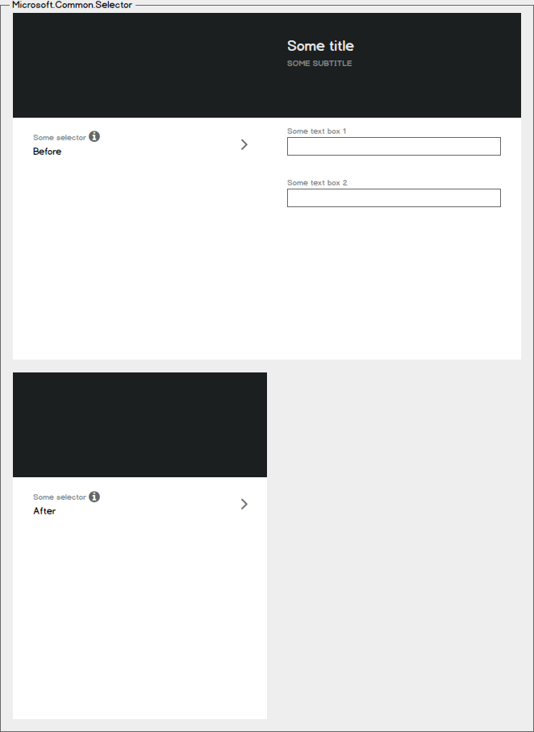
- In the top wireframe, the child blade has not yet validated successfully, so
the `sublabel.prevalidation` value is used.
- In the bottom wireframe, the child blade has successfully validated, so the
`sublabel.postvalidation` value is used.
- The `sublabel.prevalidation` value is also used if the child blade has not yet
been opened, _even if the child blade has no validation errors._

#### Schema
```json
{
  "name": "selector1",
  "type": "Microsoft.Common.Selector",
  "label": "Some selector",
  "sublabel": {
    "prevalidation": "Before",
    "postvalidation": "After"
  },
  "toolTip": "",
  "bladeTitle": "Some title",
  "bladeSubtitle": "Some subtitle",
  "elements": [
    {
      "name": "element1",
      "type": "Microsoft.Common.TextBox",
      "label": "Some text box 1"
    }
    {
      "name": "element2",
      "type": "Microsoft.Common.TextBox",
      "label": "Some text box 2"
    }
  ]
}
```
- `elements` must contain at least one element, and can contain all element
types including `Microsoft.Common.Section` and `Microsoft.Common.Selector`.
- Inline links can be embedded using Markdown syntax in the `toolTip` and
`bladeSubtitle` properties.

#### Output
To access the output values of elements in `elements`, use the `basics()` or
`steps()` functions and dot notation:
```
basics('selector1').element1
```
If the selector is nested inside a section or another selector, use the
`basics()` or `steps()` functions for the top-level element, and dot notion for
the child elements:
```
basics('section1').selector1.element1
```
Elements of type `Microsoft.Common.Selector` have no output values themselves.

### Microsoft.Compute.UserNameTextBox
This element provides a text box with built-in validation for Windows and Linux
user names.
#### UI sample
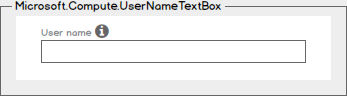

#### Schema
```json
{
  "name": "element1",
  "type": "Microsoft.Compute.UserNameTextBox",
  "label": "User name",
  "defaultValue": "",
  "toolTip": "",
  "constraints": {
    "required": true
  },
  "osPlatform": "Windows"
}
```
- If `constraints.required` is set to `true`, then the text box must contain a
value to validate successfully. The default value is `true`.
- `osPlatform` must be specified, and can be either `Windows` or `Linux`.

#### Output
```json
"tabrezm"
```

### Microsoft.Compute.CredentialsCombo
This element provides a grouped set of controls with built-in validation for
collecting either a Windows or Linux password or an SSH public key.
#### UI sample
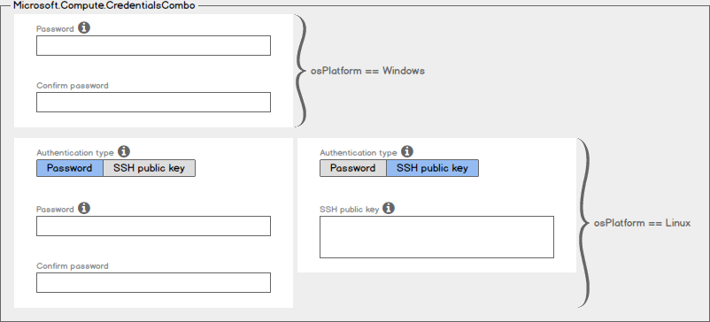

#### Schema
If `osPlatform` is `Windows`, then this is the expected element definition:
```json
{
  "name": "element1",
  "type": "Microsoft.Compute.CredentialsCombo",
  "label": {
    "password": "Password",
    "confirmPassword": "Confirm password"
  },
  "toolTip": {
    "password": ""
  },
  "constraints": {
    "required": true
  },
  "options": {
    "hideConfirmation": false
  },
  "osPlatform": "Windows"
}
```
If `osPlatform` is `Linux`, then this is the expected element definition:
```json
{
  "name": "element1",
  "type": "Microsoft.Compute.CredentialsCombo",
  "label": {
    "authenticationType": "Authentication type",
    "password": "Password",
    "confirmPassword": "Confirm password",
    "sshPublicKey": "SSH public key"
  },
  "toolTip": {
    "authenticationType": "",
    "password": "",
    "sshPublicKey": ""
  },
  "constraints": {
    "required": true
  },
  "options": {
    "hideConfirmation": false
  },
  "osPlatform": "Linux"
}
```
- `osPlatform` must be specified, and can be either `Windows` or `Linux`.
- If `constraints.required` is set to `true`, then the password or SSH public
key text boxes must contain  values to validate successfully. The default value
is `true`.
- If `options.hideConfirmation` is set to `true`, then the second text box for
confirming the user's password is hidden. The default value is `false`.

#### Output
If `osPlatform` is `Windows`, or the user provided a password instead of an SSH
public key, then this is the expected output:
```json
{
  "authenticationType": "password",
  "password": "p4ssw0rd",
}
```

If the user provided an SSH public key, then this is the expected output:
```json
{
  "authenticationType": "sshPublicKey",
  "sshPublicKey": "AAAAB3NzaC1yc2EAAAABIwAAAIEA1on8gxCGJJWSRT4uOrR13mUaUk0hRf4RzxSZ1zRbYYFw8pfGesIFoEuVth4HKyF8k1y4mRUnYHP1XNMNMJl1JcEArC2asV8sHf6zSPVffozZ5TT4SfsUu/iKy9lUcCfXzwre4WWZSXXcPff+EHtWshahu3WzBdnGxm5Xoi89zcE=",
}
```

### Microsoft.Compute.SizeSelector
This element provides a control for picking a size for one or more virtual
machine instances.
#### UI sample
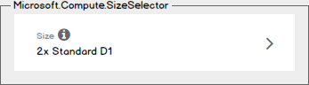

#### Schema
```json
{
  "name": "element1",
  "type": "Microsoft.Compute.SizeSelector",
  "label": "Size",
  "toolTip": "",
  "recommendedSizes": [
    "Standard_D1",
    "Standard_D2",
    "Standard_D3"
  ],
  "constraints": {
    "allowedSizes": [],
    "excludedSizes": []
  },
  "osPlatform": "Windows",
  "imageReference": {
    "publisher": "MicrosoftWindowsServer",
    "offer": "WindowsServer",
    "sku": "2012-R2-Datacenter"
  },
  "count": 2
}
```
- `recommendedSizes` should contain at least 3 sizes. The first recommended size
will be used as the default.
- Any size in `recommendedSizes` will be automatically skipped if it's not
available in the selected location, and the next recommended size will be used
in its place.
- Any size not specified in the `constraints.allowedSizes` will be hidden, and
any size not specified in `constraints.excludedSizes` will be shown.
`constraints.allowedSizes` and `constraints.excludedSizes` are both optional,
but cannot be used simultaneously.
- `osPlatform` must be specified, and can be either `Windows` or `Linux`. It's
used to determine the hardware costs of the virtual machines.
- `imageReference` must be specified. It's used to determine the software costs
of the virtual machines.
- `count` is used to set the appropriate multiplier for the label. It supports a
static value, like `2`, or a dynamic value from another element, like
`[steps('step1').vmCount]`. The default value is `1`.

#### Output
```json
"Standard_D1"
```

### Microsoft.Storage.StorageAccountSelector
This element provides a control for picking a new or existing storage account.
#### UI sample
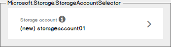

#### Schema
```json
{
  "name": "element1",
  "type": "Microsoft.Storage.StorageAccountSelector",
  "label": "Storage account",
  "toolTip": "",
  "defaultValue": {
    "name": "storageaccount01",
    "type": "Premium_LRS"
  },
  "constraints": {
    "allowedTypes": [],
    "excludedTypes": []
  }
}
```
- If specified, `defaultValue.name` will be validated for uniqueness
automatically. If the storage account name is not unique, then the user will be
required to specify a different name or choose an existing storage account.
- The default value for `defaultValue.type` is `Premium_LRS`.
- Any type not specified in `constraints.allowedTypes` will be hidden, and any
type not specified in `constraints.excludedTypes` will be shown.
`constraints.allowedTypes` and `constraints.excludedTypes` are both optional,
but cannot be used simultaneously.

#### Output
```json
{
  "name": "storageaccount01",
  "resourceGroup": "rg01",
  "type": "Premium_LRS",
  "newOrExisting": "new"
}
```

### Microsoft.Storage.MultiStorageAccountCombo
This element provides a group of controls for creating multiple storage
accounts, with names that start with a common prefix.
#### UI sample
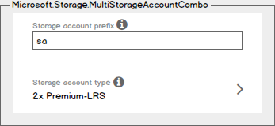

#### Schema
```json
{
  "name": "element1",
  "type": "Microsoft.Storage.MultiStorageAccountCombo",
  "label": {
    "prefix": "Storage account prefix",
    "type": "Storage account type"
  },
  "toolTip": {
    "prefix": "",
    "type": ""
  },
  "defaultValue": {
    "prefix": "sa",
    "type": "Premium_LRS"
  },
  "constraints": {
    "allowedTypes": [],
    "excludedTypes": []
  },
  "count": 2
}
```
- The value for `defaultValue.prefix` is concatenated with one or more integers
to generate the sequence of storage account names. For example, if
`defaultValue.prefix` is `foobar` and `count` is `2`, then storage account names
`foobar1` and `foobar2` will be generated. Generated storage account names are
validated for uniqueness automatically.
- The storage account names will be generated lexicographically based on
`count`. For example, if `count` is 10, then the storage account names will end
with integers 2 digits long, i.e. 01, 02, 03, etc.
- The default value for `defaultValue.prefix` is `null`, and for
`defaultValue.type` is `Premium_LRS`.
- Any type not specified in `constraints.allowedTypes` will be hidden, and any
type not specified in `constraints.excludedTypes` will be shown.
`constraints.allowedTypes` and `constraints.excludedTypes` are both optional,
but cannot be used simultaneously.
- In addition to generating storage account names, `count` is used to set the
appropriate multiplier for the label. It supports a static value, like `2`, or a
dynamic value from another element, like `[steps('step1').storageAccountCount]`.
The default value is `1`.

#### Output
```json
{
  "prefix": "sa",
  "count": 2,
  "resourceGroup": "rg01",
  "type": "Premium_LRS"
}
```

### Microsoft.Network.VirtualNetworkCombo
This element provides a group of controls for picking a new or existing virtual
network and configuring one or more subnets.

#### UI sample
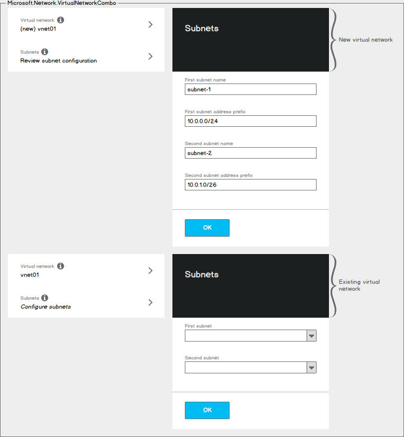
- In the top wireframe, the user has picked a new virtual network, so they will
have the ability to customize each subnet's name and address prefix. Configuring
subnets in this case is optional.
- In the bottom wireframe, the user has picked an existing virtual network, so
they will have to map each subnet the template requires to an existing subnet.
Configuring subnets in this case is required.

#### Schema
```json
{
  "name": "element1",
  "type": "Microsoft.Network.VirtualNetworkCombo",
  "label": {
    "virtualNetwork": "Virtual network",
    "subnets": "Subnets"
  },
  "toolTip": {
    "virtualNetwork": "",
    "subnets": ""
  },
  "defaultValue": {
    "name": "vnet01",
    "addressPrefixSize": "/16"
  },
  "constraints": {
    "minAddressPrefixSize": "/16"
  },
  "subnets": {
    "subnet1": {
      "label": "First subnet",
      "defaultValue": {
        "name": "subnet-1",
        "addressPrefixSize": "/24"
      },
      "constraints": {
        "minAddressPrefixSize": "/24",
        "minAddressCount": 12,
        "requireContiguousAddresses": true
      }
    },
    "subnet2": {
      "label": "Second subnet",
      "defaultValue": {
        "name": "subnet-2",
        "addressPrefixSize": "/26"
      },
      "constraints": {
        "minAddressPrefixSize": "/26",
        "minAddressCount": 8,
        "requireContiguousAddresses": true
      }
    }
  }
}
```
- If specified, the first non-overlapping address prefix of size
`defaultValue.addressPrefixSize` will be determined automatically based on the
existing virtual networks in the user's subscription.
- The default value for `defaultValue.name` and `defaultValue.addressPrefixSize`
is `null`.
- `constraints.minAddressPrefixSize` must be specified, and any existing virtual
networks with an address space smaller than `constraints.minAddressPrefixSize`
will be made unavailable for selection.
- `subnets` must be specified, and `constraints.minAddressPrefixSize` must be
specified for each subnet.
- When creating a new virtual network, each subnet's address prefix is
calculated automatically based on the virtual network's address prefix and the
respective `addressPrefixSize`. When using an existing virtual network, any
subnets smaller than the respective `constraints.minAddressPrefixSize` will be
made unavailable for selection.
Creating new subnets in an existing virtual network is not supported.
- If specified, subnets that do not contain at least `minAddressCount` available
addresses will be made unavailable for selection; the default value is `0`. To
ensure that the available addresses are contiguous, specify `true` for
`requireContiguousAddresses`; the default value is `true`.

#### Output
```json
{
  "name": "vnet01",
  "resourceGroup": "rg01",
  "addressPrefix": "10.0.0.0/16",
  "newOrExisting": "new",
  "subnets": {
    "subnet1": {
      "name": "subnet-1",
      "addressPrefix": "10.0.0.0/24",
      "startAddress": "10.0.0.1"
    },
    "subnet2": {
      "name": "subnet-2",
      "addressPrefix": "10.0.1.0/26",
      "startAddress": "10.0.1.1"
    }
  }
}
```

### Microsoft.Network.PublicIpAddressCombo
This element provides a group of controls for picking a new or existing public
IP address and configuring a domain name label.

#### UI sample
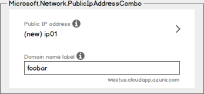
- If the user has picked no public IP address (i.e. 'None'), then the domain
name label text box will be hidden.
- If the user has picked an existing public IP address, then the domain name
label text box will be disabled and its value will be the domain name label of
the selected IP address.
- The domain name suffix (e.g. westus.cloudapp.azure.com) will automatically
update based on the selected location.

#### Schema
```json
{
  "name": "element1",
  "type": "Microsoft.Network.PublicIpAddressCombo",
  "label": {
    "publicIpAddress": "Public IP address",
    "domainNameLabel": "Domain name label"
  },
  "toolTip": {
    "publicIpAddress": "",
    "domainNameLabel": ""
  },
  "defaultValue": {
    "publicIpAddressName": "ip01",
    "domainNameLabel": "foobar"
  },
  "options": {
    "hideNone": false,
    "hideDomainNameLabel": false
  }
}
```
- If `options.hideNone` is set to `true`, then the option to select 'None' for
the public IP address will be hidden. The default value is `false`.
- If `options.hideDomainNameLabel` is set to `true`, then the text box for
domain name label will be hidden. The default value is `false`.

#### Output
If the user selected no public IP address, then this is the expected output:
```json
{
  "newOrExistingOrNone": "none"
}
```

If the user selected a new or existing IP address, then this is the expected
output:
```json
{
  "name": "ip01",
  "resourceGroup": "rg01",
  "domainNameLabel": "foobar",
  "newOrExistingOrNone": "new"
}
```
- When `options.hideNone` is specified, `newOrExistingOrNone` will always return
`none`.
- When `options.hideDomainNameLabel` is specified, `domainNameLabel` will be
undeclared.

### Microsoft.Compute.DiagnosticsCombo
#### UI sample

#### Schema

#### Output


## Supported functions
This section contains the usage for each of the supported functions that can be
used when getting or setting properties of an element.

### Referencing functions
#### basics()
Get the outputs of elements in the Basics steps. The following example returns
the output of the element named `foo` in the Basics step:
```json
"[basics('foo')]"
```

#### steps()
Get the outputs of elements in the specified step. To get the output of elements
in the Basics step, use `basics()` instead. The following example returns the
output of the element named `bar` in the step named `foo`:
```json
"[steps('foo').bar]"
```

### String functions
#### concat()
Concatenate multiple, comma-separated strings. The following example will
return the string `foobar`:
```json
"[concat('foo', 'bar')]"
```

Concatenating functions is also supported. The following example will
concatenate the outputs of `basics('foo')` and `steps('bar')`:
```json
"[concat(basics('foo'), steps('bar'))]"
```

### Math functions
#### add()
Add two numbers. The following example returns `3`:
```json
"[add(1,2)]"
```

#### sub()
Subtract two numbers. The following example returns `1`:
```json
"[sub(3,2)]"
```

#### mul()
Multiply two numbers. The following example returns `6`:
```json
"[mul(2,3)]"
```

#### div()
Divide two numbers. The following example returns `2`:
```json
"[div(6,3)]"
```

#### floor()
Return a number rounded downward to the nearest integer. The following example
returns `1`:
```json
"[floor(1.2)]"
```

#### ceil()
Return a number rounded upward to the nearest integer. The following example
returns `2`:
```json
"[ceil(1.2)]"
```

### Template functions
#### location()
Return a string that represents the current location selected in the Basics
step. For example:
```json
"westus"
```


## Contact
For any questions, e-mail <tabrezm@microsoft.com> and <vladj@microsoft.com>.
